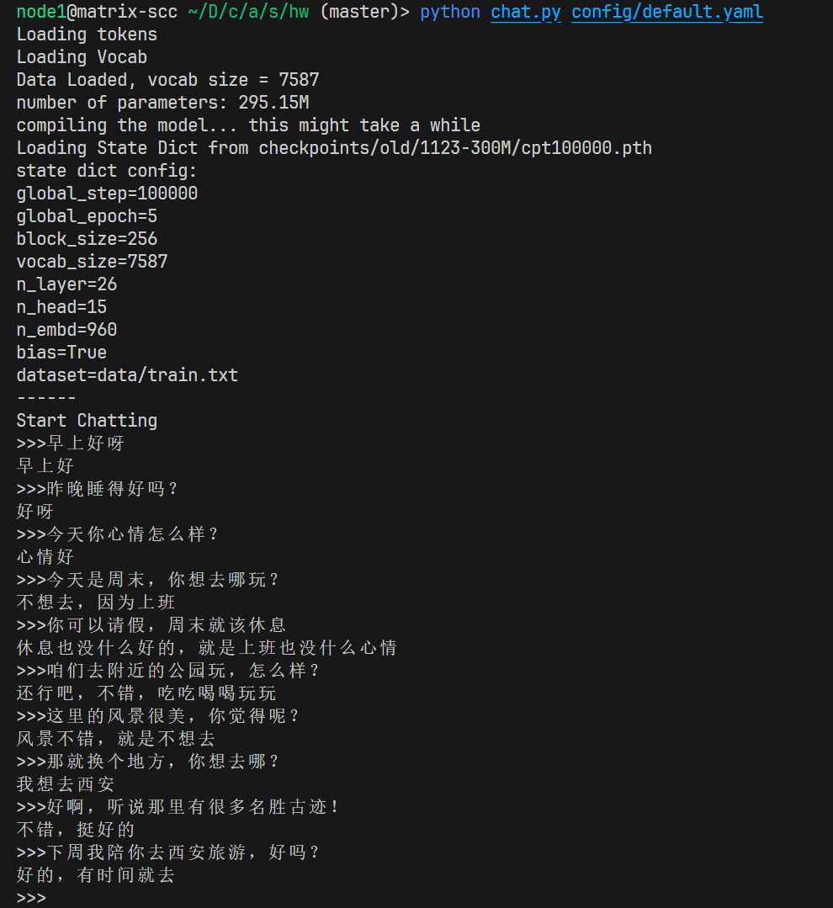
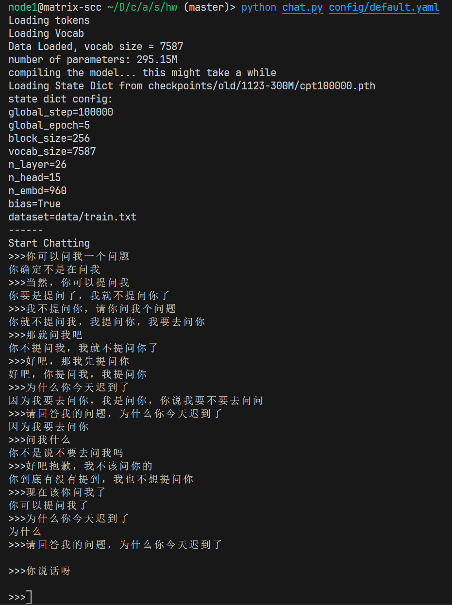
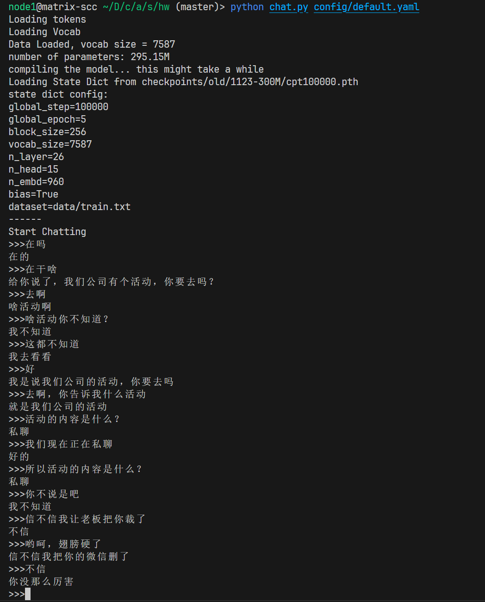
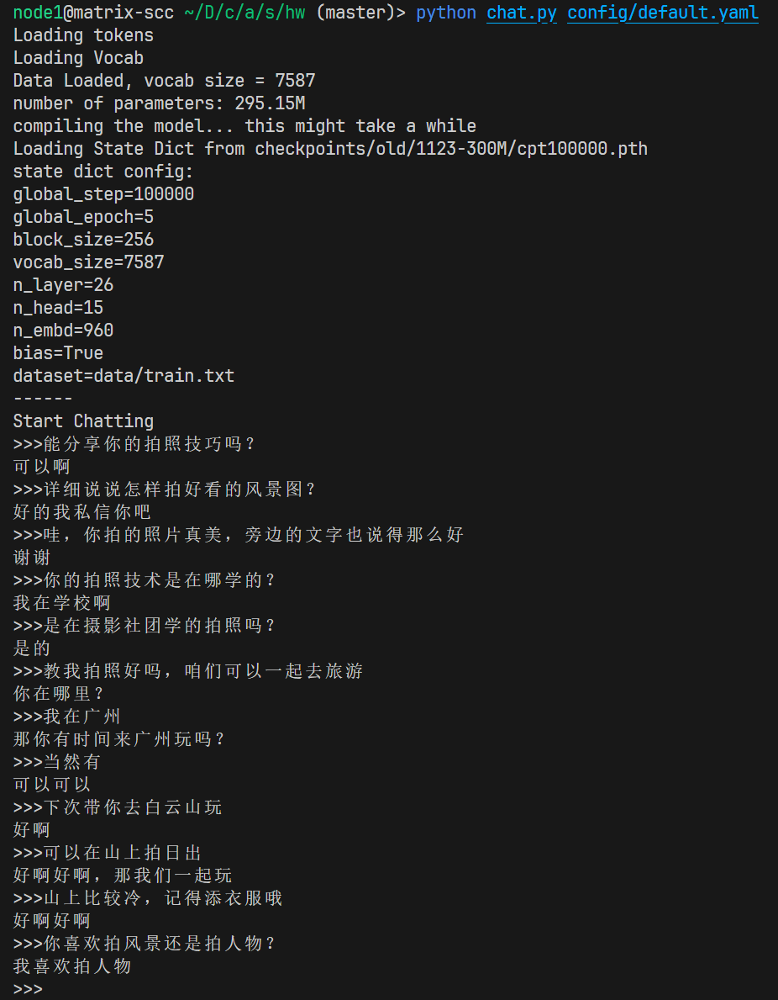

# Small GPT

本项目参考：
- [动手学深度学习](https://zh.d2l.ai/)
- [nanoGPT](https://github.com/karpathy/nanoGPT)

## 准备数据集

中文闲聊对话：

https://drive.google.com/file/d/1nEuew_KNpTMbyy7BO4c8bXMXN351RCPp/view

情感分类：

https://raw.githubusercontent.com/SophonPlus/ChineseNlpCorpus/master/datasets/ChnSentiCorp_htl_all/ChnSentiCorp_htl_all.csv 

下载数据集后存放在 data 文件夹下，路径分别为`data/train.txt`和`data/ChnSentiCorp_htl_all.csv`

## 训练

模型参数量90M

```
python train.py config/train90M.yaml     
```

模型参数量300M

```
python train.py config/train300M.yaml     
```

默认配置训练需要约16GB显存，你可以根据实际的硬件条件修改batch size

## 预训练模型🤗

你可以在hugging face🤗上下载预训练模型

```bash
mkdir -p checkpoints/pretrained
cd checkpoints/pretrained
wget https://huggingface.co/cjl196/small-gpt/resolve/main/cpt90M.pth?download=true -O cpt90M.pth
wget https://huggingface.co/cjl196/small-gpt/resolve/main/cpt300M.pth?download=true -O cpt300M.pth
```

## 对话

如果你希望使用自己训练的模型，在对话前，请修改配置文件中`resume_from`的值为模型的路径

使用下面的指令，和预训练的300M模型对话

```bash
python chat.py config/chat300M.yaml
```

## 对话效果






## 情感分类

基于预训练的300M模型，训练情感分类器

情感分类提供多个配置文件`config/sentimental*.yaml`，主要区别是是否mask、是否冻结参数，可用于消融实验

```bash
python sentimentalTrain.py config/sentimental.yaml
```

消融实验效果：

|                   | 准确度    | 训练时间     |
| ----------------- | --------- | ------------ |
| 无mask&无冻结参数 | **91.3%** | 1hr          |
| 有mask&无冻结参数 | **91.2%** | 1hr          |
| 有mask&有冻结参数 | 87.8%     | **26.63min** |