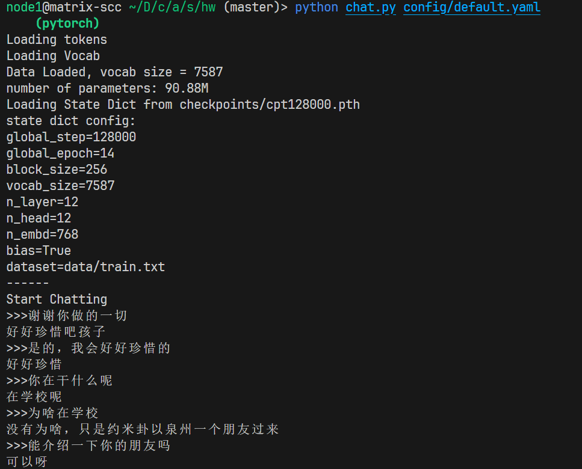

# Small GPT

本项目参考：
- [动手学深度学习](https://zh.d2l.ai/)
- [nanoGPT](https://github.com/karpathy/nanoGPT)

## 准备数据集

中文闲聊对话：

https://drive.google.com/file/d/1nEuew_KNpTMbyy7BO4c8bXMXN351RCPp/view

情感分类：

https://raw.githubusercontent.com/SophonPlus/ChineseNlpCorpus/master/datasets/ChnSentiCorp_htl_all/ChnSentiCorp_htl_all.csv 

下载数据集后存放在 data 文件夹下

## 训练

你需要指定配置文件，默认可用`config/default.yaml`

```
python train.py config/default.yaml     
```

## 对话

在对话前，请修改您的配置文件如`config/default.yaml`，修改`resume_from`指定一个模型的路径

```
python chat.py config/default.yaml
```

